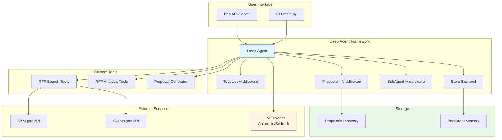
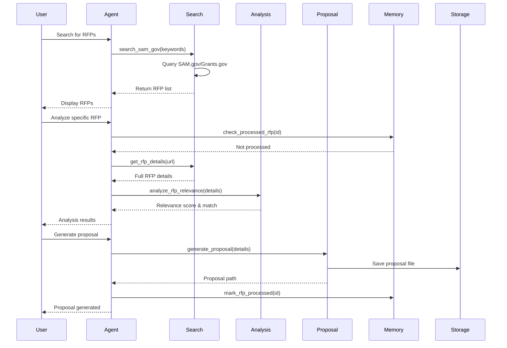
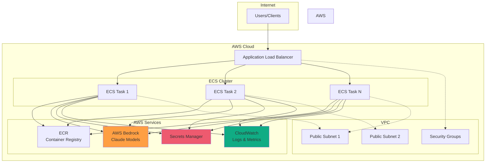

# Federal RFP Proposal Generator for Devin AI

An AI-powered system that searches for federal government Requests for Proposals (RFPs) and automatically generates tailored proposals for Cognition's Devin AI.

## Features

- **RFP Discovery**: Searches federal contracting websites (SAM.gov, Grants.gov, etc.) for relevant RFPs
- **Intelligent Analysis**: Analyzes RFP requirements and matches them with Devin AI capabilities
- **Proposal Generation**: Creates customized proposals highlighting Devin AI's strengths
- **Memory & Tracking**: Remembers processed RFPs to avoid duplicates
- **File Management**: Saves proposals and tracks progress
- **REST API**: FastAPI-based web service for easy integration
- **AWS Bedrock Support**: Deploy to AWS with managed foundation model inference

## Architecture

### System Architecture



### RFP Process Flow



### AWS Deployment Architecture



Built with **Deep Agents** framework for:
- Multi-step task planning with TodoListMiddleware
- File management with FilesystemMiddleware
- Persistent memory across sessions with StoreBackend
- Long-term tracking of processed RFPs

## Setup

1. Install dependencies:
```bash
cd rfp-proposal-generator
pip install -r requirements.txt
```

2. Configure environment variables:
```bash
cp .env.example .env
# Edit .env with your API keys
```

3. Run the agent:
```bash
python main.py
```

## Running as API Server

Start the FastAPI server:

```bash
# Using direct Anthropic API
python api.py

# Using AWS Bedrock
USE_BEDROCK=true python api.py
```

The API will be available at `http://localhost:8000`

### API Endpoints

- `GET /` - Health check
- `POST /chat` - Chat with the agent
- `POST /chat/stream` - Streaming chat
- `POST /rfp/search` - Search for RFPs
- `POST /rfp/analyze` - Analyze an RFP
- `POST /proposal/generate` - Generate a proposal

See `AWS_DEPLOYMENT.md` for detailed API documentation.

## Usage

Interact with the agent to:
- Search for new RFPs
- Analyze specific RFPs
- Generate proposals
- Review saved proposals

## Project Structure

```
rfp-proposal-generator/
├── main.py              # Main agent entry point
├── tools/               # Custom tools for RFP search and analysis
├── skills/              # Domain-specific skills
├── proposals/           # Generated proposals
├── memories/            # Persistent memory storage
└── requirements.txt     # Python dependencies
```

## Tools

- `search_rfps`: Search federal RFP websites
- `analyze_rfp`: Analyze RFP documents
- `generate_proposal`: Generate tailored proposals
- `check_processed_rfps`: Check if an RFP has been processed

## AWS Deployment

### Prerequisites Checklist

Before deploying to AWS, ensure you have:

- [ ] AWS Account with appropriate permissions
- [ ] AWS CLI installed and configured (`aws configure`)
- [ ] Docker installed and running
- [ ] AWS Bedrock enabled in your account (for Claude model access)
- [ ] Sufficient AWS quotas for ECS Fargate
- [ ] ECR permissions to push images
- [ ] VPC with at least 2 public subnets (or use default VPC)

### Quick Deploy (Automated)

The fastest way to deploy is using the automated script:

```bash
# Step 1: Navigate to project directory
cd rfp-proposal-generator

# Step 2: Set environment variables
export AWS_REGION=us-east-1
export ENVIRONMENT=production
export IMAGE_TAG=latest

# Step 3: Run deployment script
./aws/deploy.sh
```

**What the automated script does:**
1. Creates ECR repository
2. Builds Docker image
3. Pushes image to ECR
4. Prompts for and stores secrets in AWS Secrets Manager
5. Deploys CloudFormation stack (ECS, ALB, IAM roles, etc.)
6. Outputs the Load Balancer URL

**After deployment:**
- The script will display your Load Balancer URL
- Access the API at: `http://YOUR-ALB-DNS/health`
- Full API documentation at the Load Balancer URL

### Manual Deployment (Step-by-Step)

If you prefer manual control over each step:

#### Step 1: Configure AWS CLI

```bash
aws configure
# Enter your AWS Access Key ID
# Enter your AWS Secret Access Key
# Enter your default region (e.g., us-east-1)
# Enter your default output format (json)
```

Verify authentication:
```bash
aws sts get-caller-identity
```

#### Step 2: Build and Push Docker Image to ECR

```bash
# Set your variables
ACCOUNT_ID=$(aws sts get-caller-identity --query Account --output text)
AWS_REGION=us-east-1
ECR_REPO=rfp-proposal-generator
IMAGE_TAG=latest

# Create ECR repository (if it doesn't exist)
aws ecr describe-repositories --repository-names $ECR_REPO --region $AWS_REGION || \
aws ecr create-repository --repository-name $ECR_REPO --region $AWS_REGION

# Login to ECR
aws ecr get-login-password --region $AWS_REGION | \
docker login --username AWS --password-stdin $ACCOUNT_ID.dkr.ecr.$AWS_REGION.amazonaws.com

# Build the Docker image
docker build -t $ECR_REPO:$IMAGE_TAG .

# Tag the image for ECR
docker tag $ECR_REPO:$IMAGE_TAG $ACCOUNT_ID.dkr.ecr.$AWS_REGION.amazonaws.com/$ECR_REPO:$IMAGE_TAG

# Push the image to ECR
docker push $ACCOUNT_ID.dkr.ecr.$AWS_REGION.amazonaws.com/$ECR_REPO:$IMAGE_TAG
```

#### Step 3: Store Secrets in AWS Secrets Manager

```bash
AWS_REGION=us-east-1

# Create AWS Access Key secret
aws secretsmanager create-secret \
  --name rfp-proposal-generator/aws-access-key \
  --secret-string "YOUR_AWS_ACCESS_KEY_ID" \
  --region $AWS_REGION

# Create AWS Secret Key secret
aws secretsmanager create-secret \
  --name rfp-proposal-generator/aws-secret-key \
  --secret-string "YOUR_AWS_SECRET_ACCESS_KEY" \
  --region $AWS_REGION

# Create Anthropic API Key secret (fallback if not using Bedrock)
aws secretsmanager create-secret \
  --name rfp-proposal-generator/anthropic-api-key \
  --secret-string "YOUR_ANTHROPIC_API_KEY" \
  --region $AWS_REGION
```

#### Step 4: Enable AWS Bedrock Models

1. Go to AWS Console → Amazon Bedrock
2. Click "Model access" in the left sidebar
3. Click "Edit" and enable:
   - Anthropic Claude 3 Sonnet (recommended)
   - Or any other Claude model you prefer
4. Click "Save changes"

#### Step 5: Get VPC and Subnet Information

```bash
# Get your default VPC ID
VPC_ID=$(aws ec2 describe-vpcs --filters Name=isDefault,Values=true --query Vpcs[0].VpcId --output text --region $AWS_REGION)
echo "VPC ID: $VPC_ID"

# Get two subnet IDs from your VPC
SUBNET_IDS=$(aws ec2 describe-subnets --filters Name=vpc-id,Values=$VPC_ID --query Subnets[0:2].SubnetId --output text --region $AWS_REGION | tr '\t' ',')
echo "Subnet IDs: $SUBNET_IDS"
```

#### Step 6: Deploy CloudFormation Stack

```bash
# Set your variables
ACCOUNT_ID=$(aws sts get-caller-identity --query Account --output text)
AWS_REGION=us-east-1
IMAGE_URI="$ACCOUNT_ID.dkr.ecr.$AWS_REGION.amazonaws.com/rfp-proposal-generator:latest"
ENVIRONMENT=production

# Deploy the stack
aws cloudformation deploy \
  --template-file aws/cloudformation-template.yaml \
  --stack-name $ENVIRONMENT-rfp-proposal-generator \
  --capabilities CAPABILITY_IAM \
  --parameter-overrides \
    VpcId=$VPC_ID \
    SubnetIds=$SUBNET_IDS \
    ContainerImage=$IMAGE_URI \
    Environment=$ENVIRONMENT \
    UseBedrock=true \
  --region $AWS_REGION
```

#### Step 7: Monitor Deployment

```bash
# Check stack status
aws cloudformation describe-stacks \
  --stack-name $ENVIRONMENT-rfp-proposal-generator \
  --query 'Stacks[0].StackStatus' \
  --region $AWS_REGION

# View stack events (if there are issues)
aws cloudformation describe-stack-events \
  --stack-name $ENVIRONMENT-rfp-proposal-generator \
  --region $AWS_REGION
```

#### Step 8: Get Your API URL

```bash
# Get the Load Balancer DNS name
aws cloudformation describe-stacks \
  --stack-name $ENVIRONMENT-rfp-proposal-generator \
  --query 'Stacks[0].Outputs[?OutputKey==`LoadBalancerDNS`].OutputValue' \
  --output text \
  --region $AWS_REGION
```

Your API will be available at: `http://YOUR-ALB-DNS/`

### Testing Your Deployment

```bash
# Replace YOUR-ALB-DNS with your actual Load Balancer DNS
ALB_DNS="your-alb-dns.us-east-1.elb.amazonaws.com"

# Health check
curl http://$ALB_DNS/health

# Chat endpoint
curl -X POST http://$ALB_DNS/chat \
  -H "Content-Type: application/json" \
  -d '{"message": "Search for AI software development RFPs", "thread_id": "test"}'
```

### Deployment Troubleshooting

#### Issue: "AWS authentication failed"
**Solution:**
```bash
aws configure
# Re-enter your credentials
aws sts get-caller-identity  # Verify authentication
```

#### Issue: "Bedrock access denied"
**Solution:**
1. Go to AWS Console → Amazon Bedrock
2. Enable model access for Claude
3. Verify IAM role has `bedrock:InvokeModel` permission
4. Check the task role in CloudFormation stack

#### Issue: "Container health check failing"
**Solution:**
```bash
# Check CloudWatch logs
aws logs tail /ecs/production-rfp-proposal-generator --follow --region $AWS_REGION

# Common causes:
# - Missing environment variables
# - Port 8000 not exposed
# - Application startup errors
```

#### Issue: "Secrets not found"
**Solution:**
```bash
# List secrets
aws secretsmanager list-secrets --region $AWS_REGION

# Verify secrets exist
aws secretsmanager describe-secret \
  --secret-id rfp-proposal-generator/aws-access-key \
  --region $AWS_REGION
```

#### Issue: "CloudFormation stack creation failed"
**Solution:**
```bash
# View stack events
aws cloudformation describe-stack-events \
  --stack-name production-rfp-proposal-generator \
  --region $AWS_REGION

# Common fixes:
# - Check VPC and subnet IDs are valid
# - Verify ECR image exists
# - Ensure IAM permissions are sufficient
# - Check security group rules
```

### Updating Your Deployment

When you make changes to the code:

```bash
# 1. Rebuild and push new image
docker build -t rfp-proposal-generator:new-tag .
docker tag rfp-proposal-generator:new-tag $ACCOUNT_ID.dkr.ecr.$AWS_REGION.amazonaws.com/rfp-proposal-generator:new-tag
docker push $ACCOUNT_ID.dkr.ecr.$AWS_REGION.amazonaws.com/rfp-proposal-generator:new-tag

# 2. Update ECS service with new image
aws ecs update-service \
  --cluster production-rfp-proposal-generator \
  --service production-rfp-proposal-generator \
  --force-new-deployment \
  --region $AWS_REGION

# 3. Or update CloudFormation stack with new image URI
aws cloudformation deploy \
  --template-file aws/cloudformation-template.yaml \
  --stack-name production-rfp-proposal-generator \
  --parameter-overrides \
    ContainerImage=$ACCOUNT_ID.dkr.ecr.$AWS_REGION.amazonaws.com/rfp-proposal-generator:new-tag \
  --region $AWS_REGION
```

### Cleanup (Remove All Resources)

```bash
# Delete CloudFormation stack
aws cloudformation delete-stack \
  --stack-name production-rfp-proposal-generator \
  --region $AWS_REGION

# Wait for stack deletion to complete
aws cloudformation wait stack-delete-complete \
  --stack-name production-rfp-proposal-generator \
  --region $AWS_REGION

# Delete ECR repository
aws ecr delete-repository \
  --repository-name rfp-proposal-generator \
  --force \
  --region $AWS_REGION

# Delete secrets
aws secretsmanager delete-secret \
  --secret-id rfp-proposal-generator/aws-access-key \
  --region $AWS_REGION
aws secretsmanager delete-secret \
  --secret-id rfp-proposal-generator/aws-secret-key \
  --region $AWS_REGION
aws secretsmanager delete-secret \
  --secret-id rfp-proposal-generator/anthropic-api-key \
  --region $AWS_REGION
```

For more detailed AWS deployment information, see [AWS_DEPLOYMENT.md](AWS_DEPLOYMENT.md).

## Security

This project includes comprehensive security features:

- **CI/CD Pipeline**: Automated security scanning (SAST, dependency scanning, secrets detection)
- **Pre-commit Hooks**: Local security checks before commits
- **Security Policy**: Documented in `SECURITY.md`
- **Container Security**: Non-root user, minimal dependencies
- **Secrets Management**: AWS Secrets Manager integration

See `SECURITY.md` for detailed security information.